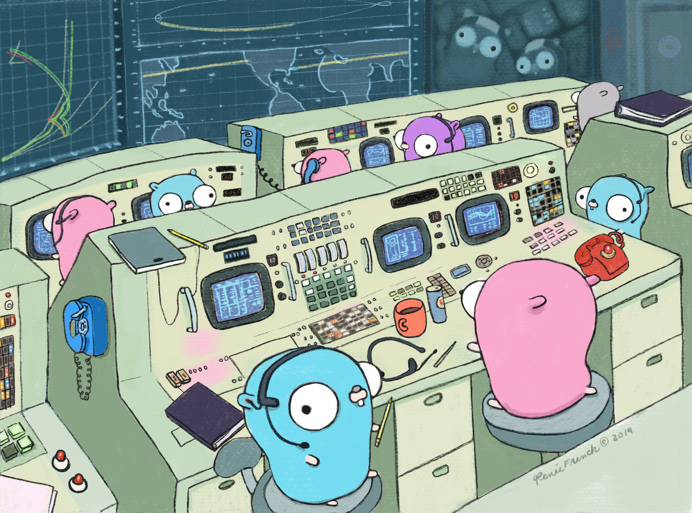
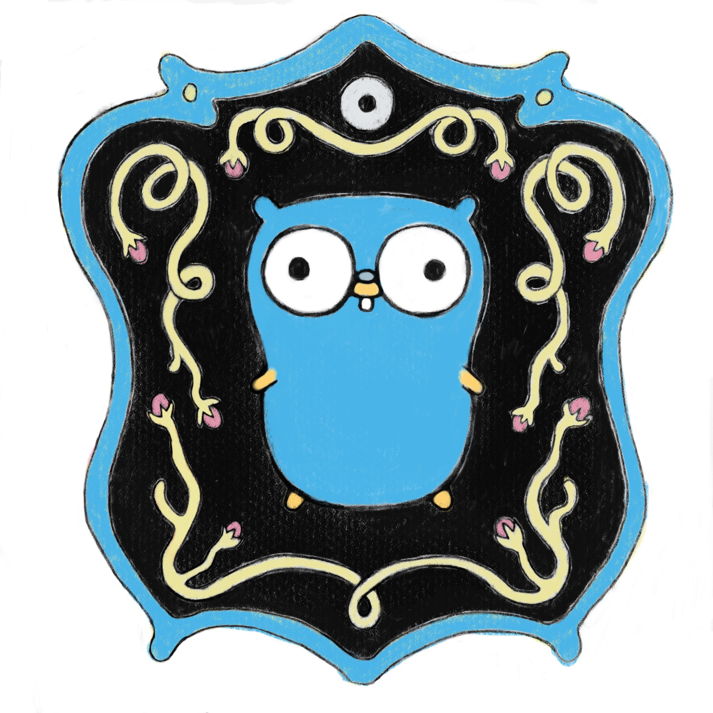

# Go 十周年
- 原文地址：https://blog.golang.org/10years
- 原文作者：Russ Cox
- 本文永久链接：https://github.com/gocn/translator/blob/master/2019/w45_go_10_years.md
- 译者：[fivezh](https://github.com/fivezh)
- 校对者：
---

生日快乐, Go!

这个周末，我们庆祝[ Go 发布](https://opensource.googleblog.com/2009/11/hey-ho-lets-go.html) 10 周年，这也是Go作为开源编程语言和构建现代网络软件生态系统的10周年。

为了纪念这一时刻，[Go gopher](https://blog.golang.org/gopher) 的创造者 [Renee French](https://twitter.com/reneefrench) 绘制了一幅欢快的场景：

庆祝 Go 十周年让我回想起了 2009 年 11 月上旬，那时我们正在准备与世界分享 Go。我们不知道会发生什么样的反应，是否会有人关心这种小语言。我希望即使没有人最终使用 Go，至少也会引起人们对一些好想法的关注，尤其是 Go 在并发编程和接口上的想法，这些都可能对后续的编程语言产生影响。

一旦人们显著对Go感兴趣的时候，我便查看了 `C`， `C++`， `Perl，` `Python` 和 `Ruby` 等流行语言的发展历史，并研究了每种语言花了多长时间才被广泛采用。例如，`Perl` 对我而言是在 1990 年代中后期完全形成的，具备 CGI 脚本和 Web 开发能力，但它其实早在 1987 年就首次发布。这一模式在几乎所有我所研究的语言中都有重复：在一门新语言真正腾飞之前，大约需要十年的时间进行安静，稳定的改进和传播。

我不禁想到：十年后 Go 将去向何方？

今天，我们可以回答这个问题：Go 现在无处不在，[全世界至少有 100 万开发者](https://research.swtch.com/gophercount)在使用。

Go 最初的目标领域是网络系统基础架构，现在称为云软件。如今，每个主要的云服务提供商都使用 Go 语言编写核心云基础架构，例如 `Docker`， `Etcd`， `Istio`， `Kubernetes`， `Prometheus`和 `Terraform`。 云原生计算基金会 [CNCF](https://www.cncf.io/projects/) 的大多数项目都使用 Go 编写。包括从头开始的初创公司和构建现代化软件系统的企业，无数公司正在使用 Go 将自己的工作迁移到云平台上。我们还发现 Go 的应用范围已远远超出了最初的云领域，其还包括使用 [GoBot](https://gobot.io/) 和 [TinyGo](https://tinygo.org/) 控制小型嵌入式系统，[在 GRAIL 上通过海量大数据分析和机器学习](https://medium.com/grail-eng/bigslice-a-cluster-computing-system-for-go-7e03acd2419b)来检测癌症，以及介于两者之间的所有内容。

所有的这一切都说明 Go 已经超越了我们最疯狂的梦想。Go 的成功不仅仅在于编程语言上，而是涵盖了编程语言、生态系统，尤其是共同努力的开源社区上，都取得了成功。

在 2009 年，Go 语言还仅是个不错的想法，带有一个实现的工作草图。而 Go 命令尚不存在：我们需要运行 `6g` 命令进行编译，运行 `6l` 命令来链接二进制文件，使用 `makefiles` 实现自动化执行。那时在语句的末尾还需要分号。整个程序甚至在垃圾回收期间会停止，继而我们努力争取用双核特性。那时 Go 还只能运行在 `Linux` 和 `Mac` 系统，运行在 32 位和 64 位 `x86` 以及 32 位的 ARM 平台上。

过去的十年里，在全球 Go 开发者的帮助下，我们已经将最初的想法和草图发展为生产型语言，具备出色的工具集、生产级实现、[先进的垃圾回收机制](https://blog.golang.org/ismmkeynote)和支持[ 12 种操作系统和 10 种架构的迁移](https://golang.org/doc/install/source#introduction)。

任何编程语言都需要蓬勃发展的生态系统来支持。开源版本是生态系统的种子，但是从那时起，许多人贡献了自己的时间和才能来发展 Go 生态系统，这包括出色的教程，书籍，课程，博客文章，播客，工具，持续集成以及通过 `go get` 分发可重复使用的软件包。没有生态系统的支持，Go 永远不可能成功。

当然，生态系统也需要活跃社区的支持。在 2019 年，全球共数十个 Go 会议，以及拥有超过 9 万成员的 150+  Go 聚会活动。[GoBridge](https://golangbridge.org/) 和 [Women Who Go](https://medium.com/@carolynvs/www-loves-gobridge-ccb26309f667) 通过指导，培训和会议奖学金方式将新的声音带入 Go 社区。仅今年一年，他们在讨论会上向来自数百团体的人们进行了培训，指导刚接触 Go 语言的人。

全球有[超过一百万的 Go 开发者](https://research.swtch.com/gophercount)，而全球各地的公司仍在寻求更多的 Go 开发者。实际上，人们经常告诉我们，学习 Go 帮助他们获得了技术行业的第一份工作。最后，我们对 Go 感到最自豪的，不是设计精良的特性或巧妙的代码，而是能在如此多人的生活中产生了积极影响。我们旨在创造一种可以帮助我们成为更好开发者的语言，很高兴Go帮助了许多其他人。

值此 [#GoTurns10](https://twitter.com/search?q=%23GoTurns10) 十周年庆祝之际，我希望每个人都花一点时间来庆祝 Go 社区以及我们所取得的一切。代表 Google 的整个 Go 团队，感谢过去十年来加入我们的每个人。让我们一起在下一个十年更加精彩！

