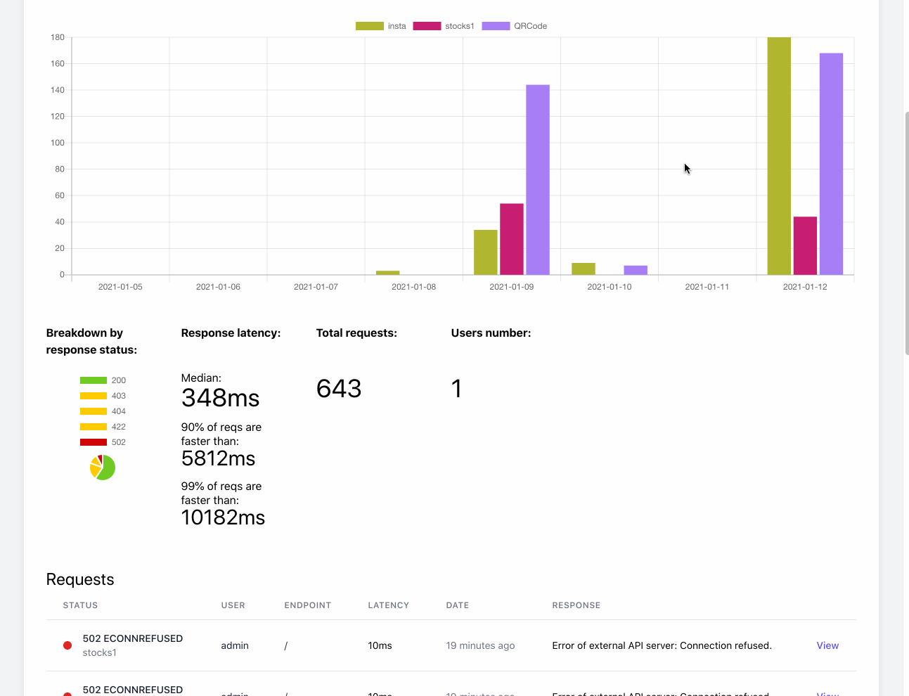

# 2021年，Clickhouse在日志存储与分析方面作为ElasticSearch和MySQL的替代方案

- 原文地址：https://pixeljets.com/blog/clickhouse-vs-elasticsearch/
- 原文作者：Anton Sidashin
- 本文永久链接：https://github.com/gocn/translator/blob/master/2021/w10_Clickhouse_for_log_storage_and_analysis_in_2021.md
- 译者：[Fivezh](https://github.com/fivezh)
- 校对：[]()

2018年，我写过一篇[关于Clickhouse的文章](https://pixeljets.com/blog/clickhouse-as-a-replacement-for-elk-big-query-and-timescaledb/)，这段内容在互联网上仍然很流行，甚至被多次翻译。 现在已经过去两年多，同时Clickhouse的开发节奏[仍然活跃](https://github.com/ClickHouse/ClickHouse/pulse/monthly): 上个月有800个合并的PR! 这难道没让你大吃一惊吗？查看这些完整变更日志以及新功能的描述或许都需要一小时才能完成，例如2020年：https://clickhouse.tech/docs/en/whats-new/changelog/2020/

> 为了公平对比，[ElasticSearch仓库在同一个月有惊人的1076个合并PR](https://github.com/elastic/elasticsearch/pulse/monthly)，同时在功能性方面，它的节奏也*非常*让人印象深刻！

我们正在将 Clickhouse 用于 ApiRoad.net 项目（这是一个API市场，开发人员出售其API，目前活跃开发中）的日志存储和分析，到目前为止，我们对效果感到满意。 作为一名API开发人员，HTTP 请求/响应周期的可观测性和分析对于评估服务质量、快速发现错误非常重要，对于纯API服务而言尤其如此。



我们也在其他项目上使用ELK（ElasticSearch，Logstash，filebeat，Kibana）技术栈用于同样目的：获取HTTP和邮件日志，使用Kibana进行事后的分析与搜索。

当然，我们也无处不在的使用MySQL！

这篇文章主要介绍我们选择 `Clickhouse` 而不是 `ElasticSearch`（或`MySQL`）作为基础数据（服务请求日志）存储解决方案的主要原因（说明：出于`OLTP`的目的，我们仍会处使用`MySQL`）。

## 1. SQL 支持, JSON 和 数组作为一等公民

`SQL`是用于数据分析的理想语言。 我喜欢`SQL`查询语言，`SQL schema`是无趣技术的完美示例，我建议在99％项目中使用它从数据中发掘真相：项目代码不完美，而如果你的数据库是结构化schema存储的，就可以相对轻松地进行改造。反言之，如果数据库数据是一个巨大的`JSON`块（`NoSQL`），没有人可以完全掌握数据的清晰结构，那么重构将会遇到更多麻烦。

尤其是在使用`MongoDB`的老项目中，我看到了这种情况。每一次新的分析报告和每一个涉及数据迁移的重构都无比痛苦。如果是新建一个这样的项目还算有趣——因为不需要花太多时间详细设计项目结构，只要“看看它是如何能跑起来”就行，但是维护它将会非常无趣！

但是，重要的是要注意，这种经验法则（“使用严格schema”）对于日志存储用例而言并不那么关键。这就是ElasticSearch如此成功、具有许多优势和灵活架构的原因。

继续回到`JSON`，就`JSON`数据的查询、语法而言，传统的关系型数据库仍在追赶`NoSQL`数据库，我们必须承认`JSON`对动态结构化数据（如日志存储）而言，是非常方便的格式。

`Clickhouse`是一种在JSON已发展存在后（不同于MySQL和Postgres）设计和构建的现代引擎。由于`Clickhouse`不必背负这些流行的RDBMS向后兼容性和严格SQL标准，`Clickhouse`团队可以在功能和改进方面更快速发展，实际上也的确是。`Clickhouse`的开发人员有更多机会在严格`schema`与`JSON`的灵活性之间达到最佳平衡，我认为他们在这方面做得很好。`Clickhouse`试图在分析领域与`Google Big Query`及其他主要对手竞争，因此它对“标准” `SQL`进行了许多改进，这使其语法成为了杀手锏，在许多用于分析和计算目的情形下相比传统RDBMS更多优势。

一些基本的例子：

在`MySQL`中，您可以提取JSON字段，但是复杂的JSON处理仅在最新版本（[具有JSON_TABLE函数的版本8](https://mysqlserverteam.com/json_table-the-best-of-both-worlds/)）中可用。 在PosgreSQL中，情况甚至更糟-在PostgreSQL 12之前还没有直接的JSON_TABLE替代方案！

而这与`Clickhouse`的JSON及相关数组功能相比，也仅仅领先一小步。数组功能相关链接：

- [arrayJoin](https://clickhouse.tech/docs/en/sql-reference/statements/select/array-join/)
- [groupArray](https://clickhouse.tech/docs/en/sql-reference/aggregate-functions/reference/grouparray/)
- [arrayMap](https://clickhouse.tech/docs/en/sql-reference/functions/array-functions/#array-map)
- [arrayFilter](https://clickhouse.tech/docs/en/sql-reference/functions/array-functions/#array-filter)

在很多情况下，PostgreSQL中`generate_series()`功能很有用。来自ApiRoad的一个具体示例：我们需要在chart.js时间轴上映射请求数量。 每天进行常规的`SELECT .. group by day`，但如果某些天没有任何查询时，就会出现间隙。但我们并不想要间隙，因此需要补零，对吧？ 这正是PostgreSQL中`generate_series()`函数有用的地方。 在MySQL中，[推荐按日期创建表并进行连接](https://ubiq.co/database-blog/fill-missing-dates-in-mysql/)，不太优雅了吧？

如下是`ElasticSearch`中如何解决：https://www.elastic.co/guide/en/elasticsearch/reference/current/search-aggregations-bucket-datehistogram-aggregation.html#_missing_value_2

关于查询语言：我对ElasticSearch的Lucene语法、HTTP API以及为检索数据而编写json等几个方面仍然不满意。而SQL将是我的首选。

这是`Clickhouse`用于日期差填充时的解决方案：

```
SELECT a.timePeriod as t, b.count as c from (
	with (select toUInt32(dateDiff('day', [START_DATE], [END_DATE])) ) 
		as diffInTimeUnits
                
	select arrayJoin(arrayMap(x -> (toDate(addDays([START_DATE], x))), 			range(0, diffInTimeUnits+1))) as timePeriod ) a
            
LEFT JOIN 
            
	(select count(*) as count, toDate(toStartOfDay(started_at)) as timePeriod from logs WHERE 
		[CONDITIONS]
		GROUP BY toStartOfDay(started_at)) b on a.timePeriod=b.timePeriod
```

在这里，我们通过`lambda`函数和循环生成一个虚拟表，然后将其按天分组的日志表进行左连接。

我认为 `arrayJoin` + `arrayMap` + `range` 函数相比 `generate_series()` 有更多灵活性。通过 `WITH FILL` 关键词可用于更简洁的语法。

## 2. 灵活的schema - 但需要时也可以严格

对于日志存储任务来说，数据schema通常会在项目生命周期中变化，`ElasticSearch`允许将巨大的JSON块放入索引中，然后找出字段类型和索引部分。 `Clickhouse`也同样支持这种方法。可以将数据放入JSON字段并相对快速地进行过滤，尽管在TB级上并不会很快。 然后，当你经常有在特定字段查询需要时，便可以在日志表中添加物化列（materialized columns），这些列能够即时的从JSON中提取值。对TB级数据查询时会更加快速。

我推荐 Altinity 关于日志存储中 JSON 与 表格式对比的专题视频：

[https://youtu.be/pZkKsfr8n3M](https://youtu.be/pZkKsfr8n3M)


## 3. 存储和查询效率

Clickhouse在`SELECT`查询时非常快速，这在[之前文章中已做讨论](https://pixeljets.com/blog/clickhouse-as-a-replacement-for-elk-big-query-and-timescaledb/)。

有趣的是，[**有证据表明**](https://youtu.be/pZkKsfr8n3M?t=2479)，与ElasticSearch相比，Clickhouse的存储效率可以高出5-6倍，而从查询的角度看，它的字面速度也要快一个数量级。还有[**另一个例子**](https://habr.com/ru/company/mkb/blog/472912/)。

我相信二者没有直接对比的基准测试，至少我找不到任何基准测试，因为Clickhouse和ElasticSearch在查询语法、缓存实现及整体特性上都非常不同。

MySQL时，在仅有1亿行日志数据的表上进行如索引失效的非最优查询，都会使服务器陷入缓慢并产生内存交换，因此MySQL并不适合大型日志查询。但是，就存储而言，压缩的InnoDB表并没有那么糟糕。 由于其基于行的特性，与Clickhouse相比，数据压缩方面的情况要差得多（抱歉，这次没有相关链接），但是它仍然可以在不显着降低性能的情况下设法降低成本 。 在某些情况下，对于少量日志来说，我们依然可以使用InnoDB表。

## 4. 统计函数

在Clickhouse中，很容易计算404查询的中位数和99分位的耗时：

```
SELECT count(*) as cnt, 
  quantileTiming(0.5)(duration) as duration_median, 
  quantileTiming(0.9)(duration) as duration_90th, 
  quantileTiming(0.99)(duration) as duration_99th
  FROM logs WHERE status=404
```

这里要注意`quantileTiming`函数的用法以及如何优雅地使用[currying](https://javascript.info/currying-partials)。 Clickhouse具有通用的分位数`quantile`函数！ 但是`quantileTiming`已[针对序列化数据进行了优化，比如加载网页时间或后端响应时间的日志](https://clickhouse.tech/docs/en/sql-reference/aggregate-functions/reference/quantiletiming/#quantiletiming).

还有更多类似的，需要加权算术平均数吗？要计算线性回归吗？这很容易，只需使用专门的函数就可以。

这是Clickhouse相关统计函数的完整列表：

https://clickhouse.tech/docs/en/sql-reference/aggregate-functions/reference/

而这些大多数在使用MySQL中是有问题的。

ElasticSearch在这方面比MySQL好得多，它既具有分位数又具有加权中位数，但是它还没有线性回归。

## 5. MySQL 和 Clickhouse 紧密结合

MySQL和Clickhouse有多种级别的相互集成，这使它们最小化数据重复的情况下非常方便在一起使用：

- [MySQL 作为外部词典](https://clickhouse.tech/docs/en/sql-reference/dictionaries/external-dictionaries/external-dicts-dict-sources/#dicts-external_dicts_dict_sources-mysql)
- [通过binlog将 MySQL 数据镜像至 Clickhouse](https://clickhouse.tech/docs/en/engines/database-engines/materialize-mysql/#materialize-mysql)
- [MySQL 数据库引擎](https://clickhouse.tech/docs/en/engines/database-engines/mysql/) - 和之前方法相似但更灵活，无需binlog
- [MySQL 表函数](https://clickhouse.tech/docs/en/sql-reference/table-functions/mysql/) 通过特定查询链接 MySQL 表
- [MySQL 表引擎](https://clickhouse.tech/docs/en/engines/table-engines/integrations/mysql/) 在CREATE TABLE语句中静态描述特定表
- [Clickhouse 使用 MySQL 协议](https://clickhouse.tech/docs/en/interfaces/mysql/)

我不能肯定地说动态数据库和表引擎在JOIN上有多么快速和稳定，这肯定是需要基准测试的。但这个概念非常吸引人-你已经可以在Clickhouse数据库上完整地复制MySQL表 ，而不必处理缓存失效和重新设置索引。

关于将MySQL与Elasticsearch结合使用，我的有限经验表明，这两种技术有太多不同。我的印象是他们彼此各说各话，并不会组合出现。所以我通常只需要把ElasticSearch需要索引的数据JSON化，然后发送到ElasticSearch。 之后，MySQL数据一些迁移或任何变更操作（UPDATE / REPLACE）之后，在Elasticseach端找出需要重新索引的部分。 关于MySQL和ElasticSearch的数据同步，这是一篇[基于Logstash实现的文章](https://www.elastic.co/blog/how-to-keep-elasticsearch-synchronized-with-a-relational-database-using-logstash)。 我不太喜欢Logstash，因为它的性能一般，对内存要求也很高，同时它也会成为系统中不稳定因素。 对于使用MySQL的简单项目中，数据同步和索引往往是阻止我们使用Elasticsearch的因素。

## 6. 新特性

是否要附加S3存储CSV文件并将其视为Clickhouse中的表？ [这非常简单](https://clickhouse.tech/docs/en/engines/table-engines/integrations/s3/)。

是否要更新或删除日志行以符合数据保护规范？ 现在，这很容易！

在我2018年写第一篇文章时，Clickhouse还没有简单的方法来删除或更新数据，这是一个真正的弊端。 现在，这不再是问题。 Clickhouse利用自定义SQL语法删除数据行：

```
ALTER TABLE [db.]table [ON CLUSTER cluster] DELETE WHERE filter_expr
```

原因很明确，对于Clickhouse（和其他列式数据库）来说，删除仍然是一项相当昂贵的操作，因此最好不要生产环境频繁使用。

## 7. 缺点

与ElasticSearch相比，Clickhouse也有缺点。 首先，如果构建用于日志存储的内部分析，那么就需要最好的GUI工具。Kibana目前在这方面相比Grafana会是很好的选择（至少，这种观点非常流行，Grafana UI有时并不那么顺滑）。 如果使用Clickhouse，则必须使用Grafana或Redash。（我们喜欢的[Metabase](https://github.com/enqueue/metabase-clickhouse-driver)也获得了Clickhouse的支持！）

但是，在我们的案例中，我们正在构建面向用户的分析方法，因此无论如何我们都必须从头开始构建分析GUI（我们使用Laravel，Inertia.js，Vue.js和 Charts.js来实现用户界面）。

另一个与生态系统有关的问题是：消费、处理、发送数据到Clickhouse的工具是有限制。 对于Elasticsearch，有Logstash和filebeat，它们是Elastic生态系统固有的工具，旨在完美地协同工作。 幸运的是，Logstash也可以用于将数据放入Clickhouse，从而缓解了该问题。 在ApiRoad中，我们使用了自己定制的Node.js日志传送程序，该程序将日志汇总，然后分批发送给Clickhouse（因为Clickhouse喜欢大批处理，而不是小的多次插入）。

我在Clickhouse中不喜欢的还有一些函数的奇怪命名，这是因为Clickhouse是由Yandex.Metrika（Google 分析的竞争对手）创建的。 比如，`visitParamHas()`是用于检查JSON中是否存在特定键。 通用目的，但并不是通用名称。 有一堆名字不错的JSON函数名，例如 `JSONHas()`。还有一个有趣的细节：据我所知，它们使用不同的[JSON解析引擎](https://github.com/simdjson/simdjson)，虽然更符合标准，但速度稍慢。

## 总结

ElasticSearch是一个非常强大的解决方案，但我认为它最强的方面仍然是超过10+节点的支持，用于大型全文检索和facets，复杂的索引和分值计算-这是ElasticSearch的亮点。当我们提及时间序列和日志存储时，似乎有更好的解决方案，而Clickhouse就是其中之一。 ElasticSearch API的功能非常强大，但在很多情况下，如果不从文档中复制具体HTTP请求，就很难记住如何做一件事，它有更多的“企业化”和“Java风格”。 Clickhouse和ElasticSearch都是占用内存很大的程序，Clickhouse内存要求为4GB，而ElasticSearch的内存要求为16GB。我还认为Elastic团队关注的重点是他们新的[机器学习功能](https://www.elastic.co/what-is/elasticsearch-machine-learning)，我的愚见是，尽管这些功能听起来非常新潮，但不论你拥有多少开发人员和金钱，这些庞大的功能集很难持续支持和改进。对我来说，ElasticSearch在不断的进入“博而不精”的状态。或许，是我错了。

Clickhouse则与众不同。设置简单、SQL也简单、控制台客户端也很棒。通过少量配置，就可以让一切简单有效的工作起来，但是当有需要时，也可以在TB级数据上使用丰富的特性、副本和分片能力。