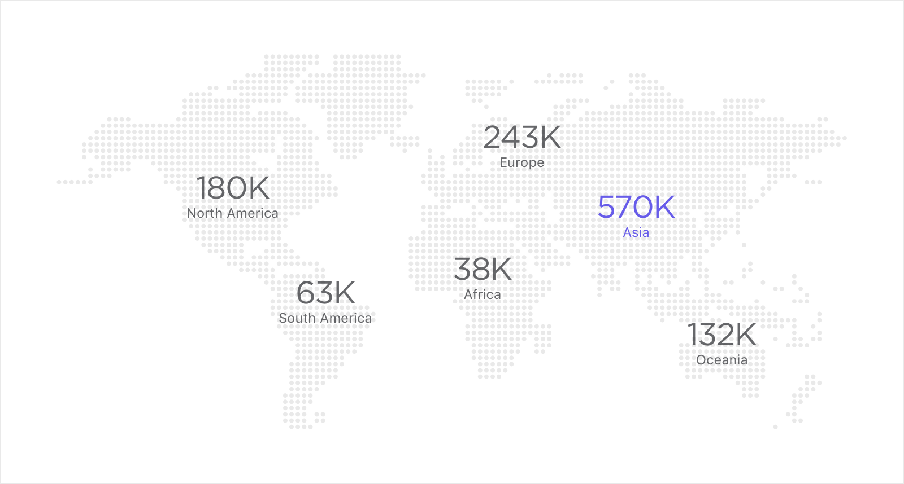
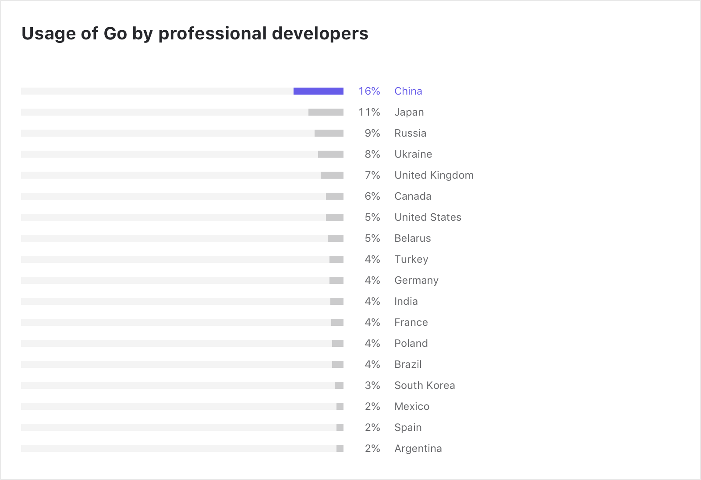
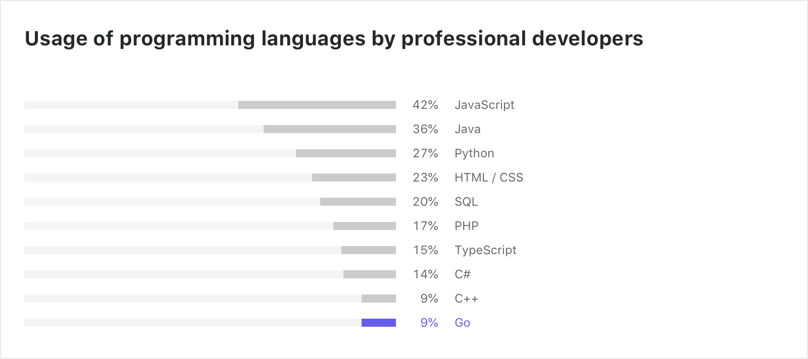
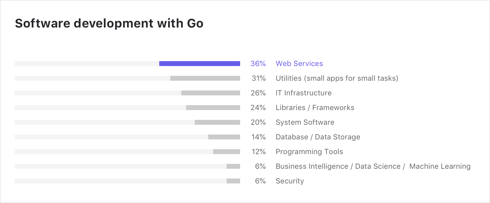
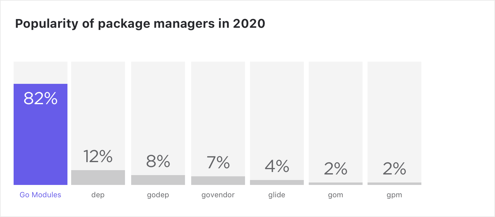
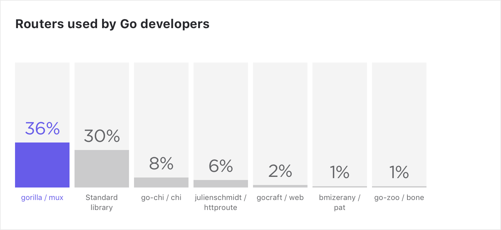
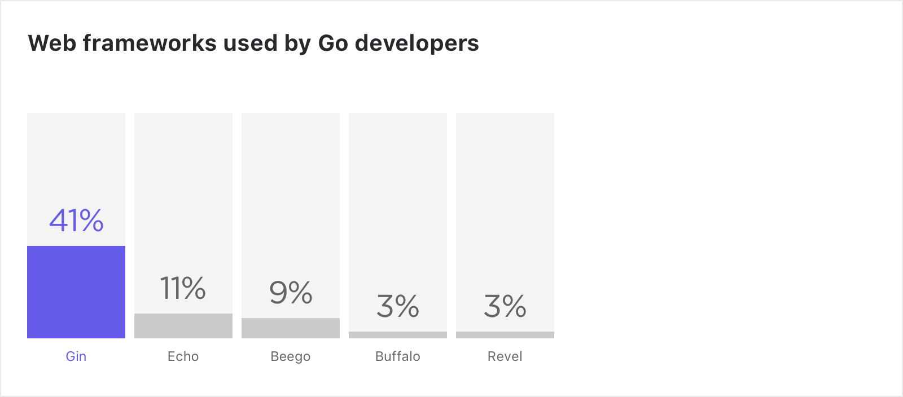
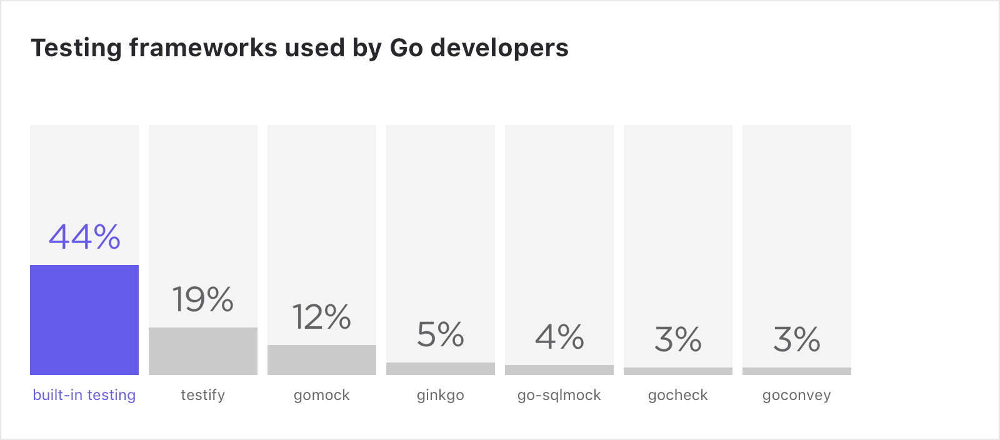
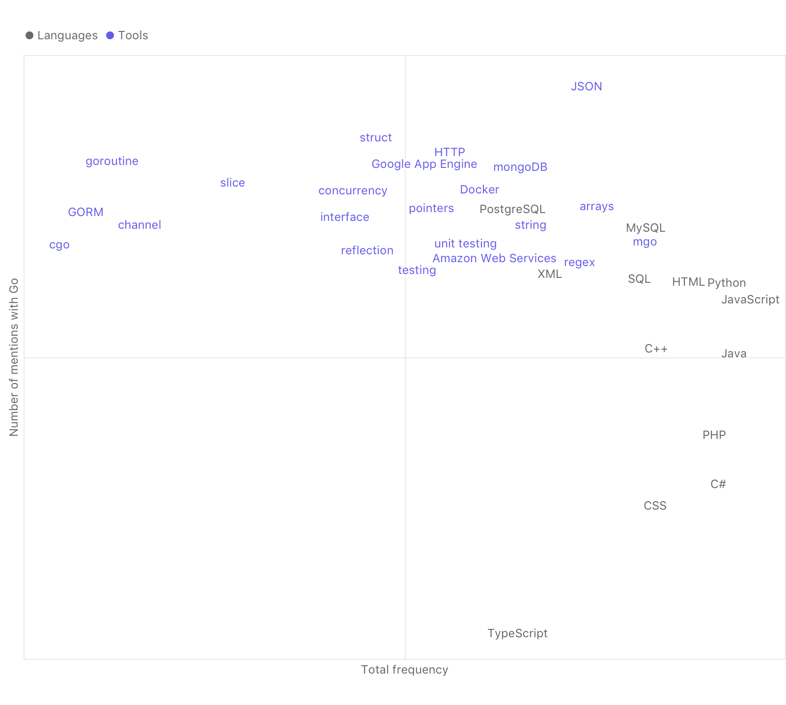

# The state of Go

The Go language is high up on the list of popular programming languages used today. We already know that its enthusiastic, fun, and welcoming community of users like it for its speed and effectiveness, but we wanted to find out a bit more. We have taken a deeper look into the information available on Go to uncover more facts. Our resident Go expert, Florin Pățan, Developer Advocate for GoLand, has been brought in to provide his take on the findings to discover the state of Go.

在当今最流行的编程语言列表里，Go语言一直是名列前茅。我们已经知道了Go语言的火热、有趣、受社区用户的欢迎，正如它速度和效率那样，但是我们还想知道更多。我们为了发现更多的事实，在目前Go现有的信息的基础上，进行了深入研究。我们邀请了Go语言专家、Goland开发倡导者`Florin Pățan` 来发表他对Go语言状态的看法。

哪里的人在使用Go语言
-----

### 约110万Go开发中

总的来说，大约有**110万专业的 Go 开发者**使用 Go 作为**主要开发语言**。 如果我们把那些使用其他语言作为主力开发语言，但是把Go当作业余爱好的开发人员算在内的话，这一数字可能接近**270万**。

就全球分布而言，居住在**亚洲**的Go开发者最多，大约有57万开发者使用 Go 作为主要开发语言。

_专家分析_

这也正是我最期待的使用Go开发的地方。就Go用户数量而言，亚洲高居榜首，我认为主要原因是有大量的来自像腾讯、阿里巴巴、华为这些大公司的开发者。这些公司一般都有很多开发人员。

具体在哪里
------------------

The graph below shows the distribution of developers in each country we surveyed in the [Developer Ecosystem survey 2020](https://www.jetbrains.com/lp/devecosystem-2020/go/) who use Go as a primary language (respondents were able to choose up to 3 primary languages). **China** has the highest concentration, with 16% of Chinese developers writing in Go.

下图显示了我们在 [2020开发者生态调查](https://www.jetbrains.com/lp/devecosystem-2020/go/) 中调查的每个国家使用Go作为主要语言的开发者的分布情况（受访者最多可以选择3种主要语言）。**中国** 的开发者集中度最高，有16%的中国开发者在使用Go。

_专家分析_

看到中国排在榜首，我一点也不惊讶。我本以为俄罗斯会排在第二，美国会高一点，大概在前五位。

中国之所以排在榜首，可能正是因为他们拥有的开发者数量最多。而且我认识的很多公司，比如PingCAP、腾讯和华为，都有很多开发者来支撑和构建他们的内部工具、基础设施和后端服务，这些服务都和微服务相结合。这可能才是关键。

I know that in Russia the Go communities are really awesome, so it’s no wonder Go is a popular language there. I am curious about Japan and Ukraine as I didn’t expect that they would be quite so high up, and I’d expect Germany and India to be a bit higher. I remember back four or five years ago when I was in Berlin that Go was used in pretty much every startup that I knew.

我知道俄罗斯的Go社区非常棒，所以难怪Go在那里很受欢迎。

Industry insights
-----------------

Go remains the **10th primary language** used by professional developers, with a share of about 9% according to the [Developer Ecosystem survey 2020](https://www.jetbrains.com/lp/devecosystem-2020/go/).

_Expert analysis_

I think Go is always growing. People don’t tend to start off with Go as their first programming language but instead usually migrate to Go from other languages such as PHP and Ruby, but mainly from C++ and C#, from what I know.

The advantages of Go over PHP would be the type safety, since Go is a statically typed language, whereas PHP is dynamic. It means that the compiler does most of the work for you in terms of making sure that the code you wrote will compile and work without having problems at runtime. The advantage Go has over C++ is simplicity. In Go, it’s all pretty straightforward.

In general, the thing with Go is that it has a lot of speed built in, both when writing the code and at runtime. In general, with Go you’d get maybe 5-10 times the performance without having to do any special optimizations, and that’s an important productivity advantage for companies. It’s also a simple language, it’s easy to pick up, and it’s easy to replace microservices in existing projects.

A lot of the IT infrastructure tools like Kubernetes, Docker, and Vault – to name a few of the big ones – are built using Go. So, while there are a lot of companies that work with Java, they would also have a team that does Go, especially for maintenance and patching of such projects. That’s probably one of the other reasons the adoption keeps increasing; the more that technology is used in common infrastructure and deployments, the more Go will grow. So I think more and more people will start using Go in the next few years and we will see Go at maybe 15-20%, especially considering the question from the Developer Ecosystem survey “"Do you plan to adopt / migrate to other languages in the next 12 months? If so, to which ones?" where 13% of respondents answered Go.

Type of software developed with Go
----------------------------------

**Web Services** are the most popular area where Go is used, with a share of 36% according to the results from the [Developer Ecosystem survey 2020](https://www.jetbrains.com/lp/devecosystem-2020/go/).

_Expert analysis_

For web services, I think the top task is creating API servers that are fairly fast. They don’t necessarily need a framework, so you can get up and running quickly with Go.

I don’t expect that this graph will change too much in the future. I do expect to see web services getting more share just because it’s simple to get started in it with Go.

For "Utilities", I see a similar story as it’s fairly easy to write a quick app that lets you process a large volume of data and write small utility apps or one-off tasks that need a lot of power. It also makes sense to see the IT infrastructure there. The more people that adopt Docker and Kubernetes, the more people that will come to Go, just because they are both written in Go. Any kind of DevOps work can especially benefit from Go, as it offers type safety and speed. It’s quite easy to interact with the cloud side of the infrastructure – Google, Amazon, and Azure, among others – as they all have good SDKs. I think we can also expect a bit of a boost in “Libraries / Frameworks” in the next couple of years when generics arrive.

System software – I think this will begin to decline as more people start using something like Rust for system software. And the same for databases. So it’s probably going to be a niche domain in the future somewhere around the 6% mark. Programming tools – I am surprised this is so high on the list, I would be interested to learn what programming tools are being made in Go.

Top industries where Go is used
-------------------------------

According to the [_Developer Ecosystem Survey 2020_](https://www.jetbrains.com/lp/devecosystem-2020/go/), Go programmers work mainly in **IT Services**, followed by **Finance and FinTech**, **Cloud Computing / Platform,** and other industries.

_Expert analysis_

Financing and FinTech. That’s something that I expect to see just because I know there are quite a few banks that have been launched with Go or are using Go extensively for their infrastructure. For example, [Monzo, from the UK, built their whole bank using Go](https://monzo.com/blog/2016/09/19/building-a-modern-bank-backend). Cloud computing and platforms also makes sense, as it is natural with the kinds of applications that are being written in Go.

Mobile development, that’s unexpected to see. Go doesn’t really have a good mobile development history. If anything, I would expect people to probably do their web services or backends for mobile apps with Go, but that is about it.

There are a few industries I would not expect to see Go usage increasing in anytime soon. For example, anything based on machine learning, because that’s still quite a Python stronghold. There are efforts to make machine learning popular in Go and make it better, however I think that any results are at least a couple of years away.

Go tools
--------

### Package Managers

**Go Modules** is the most popular package manager among Go developers. Its adoption rose from 41% in [2019](https://www.jetbrains.com/lp/devecosystem-2019/go/) to 82% in [2020](https://www.jetbrains.com/lp/devecosystem-2020/go/), according to the _Developer Ecosystem Survey 2020_.

_Expert analysis_

I think at some point we’ll probably have to stop asking this question, just because Go Modules is set to become the standard default model and the Go team also wants to deprecate GOPATH. Everything else will probably just be obsolete then.

### Go routers

**Gorilla / Mux** and **Standard library** have remained the most used Go routers since 2018 according to the Developer Ecosystem surveys carried out in [2020](https://www.jetbrains.com/lp/devecosystem-2020/go/) and [2018](https://www.jetbrains.com/research/devecosystem-2018/go/).

_Expert analysis_

The standard library is probably so popular because whenever you go to Reddit, Slack, or any other place, people will usually recommend sticking with the standard library and only using something else if you really want. I use gorilla/mux, just because there is a bit more abstraction on top of the standard library without sacrificing too much performance. It’s also probably because this is one of the closest to the standard library and it makes writing servers easier. Overall this distribution is probably what I would expect to see.

### Top 5 web frameworks

The usage of **Gin** has nearly doubled since 2018, while the rest of the web frameworks have largely remained stable, according to the [2020](https://www.jetbrains.com/lp/devecosystem-2020/go/) and [2018](https://www.jetbrains.com/research/devecosystem-2018/go/) Developer Ecosystem surveys.

_Expert analysis_

Gin is likely so popular for web because it’s one of the faster frameworks and also gets good recommendations. It’s also one of the oldest ones. So there’s a lot of material out there, and a lot of users are already using and recommending it.

### Testing frameworks

The proportion of devs using **built-in testing** fell from 64% in [2018](https://www.jetbrains.com/research/devecosystem-2018/go/) to 44% in [2020](https://www.jetbrains.com/lp/devecosystem-2020/go/) while the usage of other testing frameworks grew slightly.

_Expert analysis_

The built-in testing is high because the Go standard library has a really good testing library out of the box.

Built-in testing has probably dropped because more people are coming to the language from other languages, like PHP for instance, and they are seeking to replicate the testing habits they already have.

Most discussed Go tools and other languages
-------------------------------------------

Go is often discussed in IT communities, one of which is Stack Overflow. We took data from the Q&A section to find out which tags co-occur with “Go” the most. Among them, there are 23 tools and 2 languages – “MySQL” and “PostgreSQL”. Apart from the tools, there are co-occurrences with other top languages. The vertical axis indicates the total number of occurrences of the tags while the horizontal axis shows mentions of the tags with “Go”.

_Expert analysis_

I expect JSON to be a problem. It’s not easy to marshal and unmarshal JSON into Go data structures and this is probably why it’s so visible. Structs come up as people coming from other languages usually have a hard time wrapping their head around this, apart from maybe if they come from C++ or C.

Amazon Web Services is where I would expect a lot of questions based on the popularity of AWS itself. It’s more straightforward to develop Go apps for Google App Engine now, which was not always the case, hence why there are so many questions.

All in all, the Go community is a pretty fun and inclusive community to be a part of. Newbies are never pushed away and they are encouraged to ask questions and discover the language. In terms of topics in general, generics and maybe some language improvements, compiler improvements, and so on are discussed most regularly.

Generics particularly as it is one of the most requested features for the language and there are plenty of workloads that would benefit from having this feature.

--------------------------------------------------------------------

Is your team curious to try GoLand? Get an extended trial for an unlimited number of users.

[Request now!](https://www.jetbrains.com/shop/eform/extended-trial/go/)