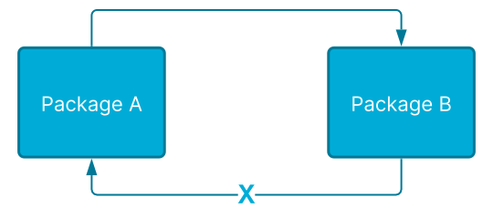
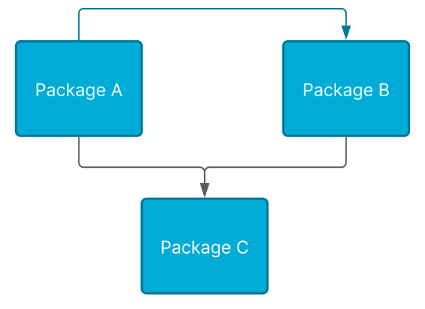
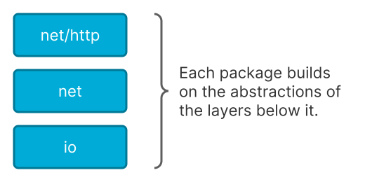
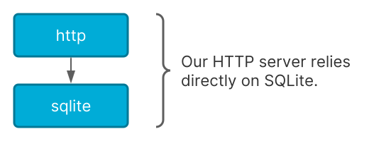
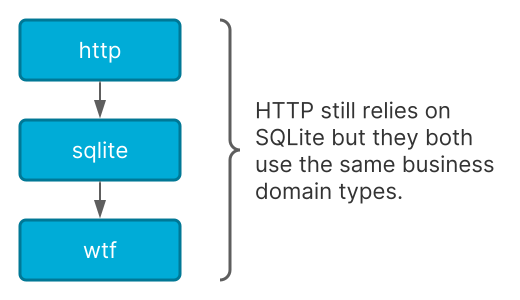
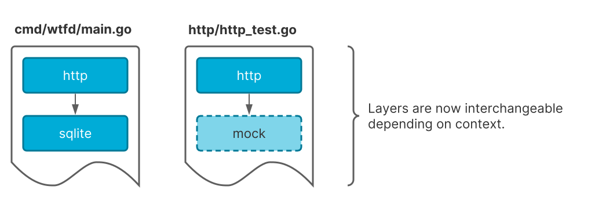

# Packages as layers, not groups

- 原文地址：https:/www.gobeyond.dev/packages-as-layers/
- 原文作者：Ben Johnson
- 本文永久链接：https:/github.com/gocn/translator/blob/master/2021/w7_packages_as_layers_not_groups.md
- 译者：[cvley](https:/github.com/cvley)
- 校对：[guzzsek](https:/github.com/guzzsek)


Four years ago, I wrote an article called [_Standard Package Layout_](https:/www.gobeyond.dev/standard-package-layout/) that tried to address one of the most difficult topics for even advanced Go developers: package layout. However, most developers still struggle with organizing their code into a directory structure that will grow gracefully with their application.

Nearly all programming languages have a mechanism for grouping related functionality together. Ruby has gems, Java has packages. Those languages don't have a standard convention for grouping code because, honestly, it doesn't matter. It all comes down to personal preference.

However, developers that transition to Go are surprised by how often their package organization comes back to bite them. Why are Go packages so different from other languages? It's because they're not groups—they're layers.

## Understanding cyclic dependencies

The primary difference between Go packages and grouping in other languages is that Go doesn't allow for circular dependencies. Package A can depend on package B, but then package B cannot depend back on package A.



Package dependencies can only go one way.

This restriction causes issues for developers later on when they need to have both packages share common code. There are typically two solutions: either combine both packages into a single package or introduce a third package.



However, splitting out into more and more packages only pushes the problem down the road. Eventually, you end up with a large mess of packages and no real structure.

## Borrowing from the standard library

One of the most useful tips when programming Go is to look to the standard library when you need guidance. No code is perfect, but the Go standard library encapsulates many of the ideals of the creators of the language.

For example, the `net/http` package builds on top of the abstractions of the `net` package, which, in turn, builds on the abstractions of the `io` layer below it. This package structure works well because it would be nonsensical to imagine the `net` package needing to somehow depend on `net/http`.



While this works well in the standard library but can be difficult to translate to application development.

## Applying layers to application development

We'll be looking at an example application called [WTF Dial](https:/github.com/benbjohnson/wtf), so you can read the [introductory post](https:/www.gobeyond.dev/wtf-dial/) to understand more about it.

In this application, we have two logical layers:

1.  An SQLite database
2.  An HTTP server

We create a package for each of these—`sqlite` & `http` . Many people will balk at naming a package the same name as a standard library package. That's a valid criticism and you could name it `wtfhttp` instead, however, our HTTP package fully encapsulates the `net/http` package so we never use them both in the same file. I find that prefixing every package is tedious and ugly, so I don't do it.

### The naive approach

One way to structure our application would be to have our data types (e.g., `User`, `Dial`) and our functionality (e.g., `FindUser()`, `CreateDial()`) inside `sqlite`. Our `http` package could depend directly on it:



This is not a bad approach, and it works for simple applications. We end up with a few issues though. First, our data types are named `sqlite.User` and `sqlite.Dial`. That sounds odd as our data types belong to our application—not SQLite.

Second, our HTTP layer can only serve data from SQLite now. What happens if we need to add a caching layer in between? Or how do we support other types of data storage such as Postgres or even storing as JSON on disk?

Finally, we need to run an SQLite database for every HTTP test since there's no abstraction layer to mock it out. I generally support doing end-to-end testing as much as you can, but there are valid use cases for introducing unit tests in your higher layers. This is especially true once you introduce cloud services that you wouldn't want to run on every test invocation.

### Isolating your business domain

The first thing we can change is moving our _business domain_ to its own package. This can also be called the "application domain". It's the data types specific to your application—e.g., `User`, `Dial` in the case of WTF Dial.

I use the root package (`wtf`) for this purpose as it's already conveniently named after my application, and it's the first place new developers look when they open the code base. Our types are now named more appropriately as `wtf.User` and `wtf.Dial`.



You can see an example of this with the `wtf.Dial` type:

```golang
type Dial struct {
	ID int `json:"id"`

	/ Owner of the dial. Only the owner may delete the dial.
	UserID int   `json:"userID"`
	User   *User `json:"user"`

	/ Human-readable name of the dial.
	Name string `json:"name"`

	/ Code used to share the dial with other users.
	/ It allows the creation of a shareable link without
	/ explicitly inviting users.
	InviteCode string `json:"inviteCode,omitempty"`

	/ Aggregate WTF level for the dial.
	Value int `json:"value"`

	/ Timestamps for dial creation & last update.
	CreatedAt time.Time `json:"createdAt"`
	UpdatedAt time.Time `json:"updatedAt"`

	/ List of associated members and their contributing WTF level.
	/ This is only set when returning a single dial.
	Memberships []*DialMembership `json:"memberships,omitempty"`
}
```
    
[dial.go#L14-50](https:/github.com/benbjohnson/wtf/blob/e23f5f00e0f48f54bd751cc264ea85c094f7d466/dial.go#L14-L50)

In this code, there is no reference to any implementation details—just primitive types & `time.Time`. JSON tags are added for convenience.

### Remove dependencies by abstracting services

Our application structure is looking better, but it's still odd that HTTP depends on SQLite. Our HTTP server wants to fetch data from an underlying data storage—it doesn't specifically care if it's SQLite or not.

To fix this, we'll create interfaces for the services in our business domain. These services are typically Create/Read/Update/Delete (CRUD) but can extend to other operations.

```golang
/ DialService represents a service for managing dials.
type DialService interface {
	/ Retrieves a single dial by ID along with associated memberships. Only
	/ the dial owner & members can see a dial. Returns ENOTFOUND if dial does
	/ not exist or user does not have permission to view it.
	FindDialByID(ctx context.Context, id int) (*Dial, error)

	/ Retrieves a list of dials based on a filter. Only returns dials that
	/ the user owns or is a member of. Also returns a count of total matching
	/ dials which may different from the number of returned dials if the
	/ "Limit" field is set.
	FindDials(ctx context.Context, filter DialFilter) ([]*Dial, int, error)

	/ Creates a new dial and assigns the current user as the owner.
	/ The owner will automatically be added as a member of the new dial.
	CreateDial(ctx context.Context, dial *Dial) error

	/ Updates an existing dial by ID. Only the dial owner can update a dial.
	/ Returns the new dial state even if there was an error during update.
	/
	/ Returns ENOTFOUND if dial does not exist. Returns EUNAUTHORIZED if user
	/ is not the dial owner.
	UpdateDial(ctx context.Context, id int, upd DialUpdate) (*Dial, error)

	/ Permanently removes a dial by ID. Only the dial owner may delete a dial.
	/ Returns ENOTFOUND if dial does not exist. Returns EUNAUTHORIZED if user
	/ is not the dial owner.
	DeleteDial(ctx context.Context, id int) error
}
```
    
[dial.go#L81-L122](https:/github.com/benbjohnson/wtf/blob/e23f5f00e0f48f54bd751cc264ea85c094f7d466/dial.go#L81-L122)

Now our domain package (`wtf`) specifies not just the data structures but also the interface contracts for how our layers can communicate with one another. This flattens our package hierarchy so that all packages now depend on the domain package. This lets us break direct dependencies between packages and introduce alternate implementations such as a `mock` package.


### Repackaging packages

Breaking the dependency between packages allows us flexibility in how we use our code. For our application binary, `wtfd`, we still want `http` to depend on `sqlite` (see `[wtf/main.go](https:/github.com/benbjohnson/wtf/blob/main/cmd/wtfd/main.go#L180-L205)`) but for our tests we can change `http` to depend on our new `mock` package (see `[http/server_test.go](https:/github.com/benbjohnson/wtf/blob/main/http/server_test.go#L22-L59)`):



This may be overkill for our small web application, WTF Dial, but it becomes increasingly important as we grow our codebase.

## Conclusion

Packages are a powerful tool in Go but are the source of endless frustration if you view them as groups instead of layers. After understanding the logical layers of your application, you can extract data types & interface contracts for your business domain and move them into your root package to serve as a common domain language for all subpackages. Defining this domain language is essential to growing your application over time.

Have question or comment? Please open a thread on the [WTF Dial GitHub Discussion board](https:/github.com/benbjohnson/wtf/discussions).
